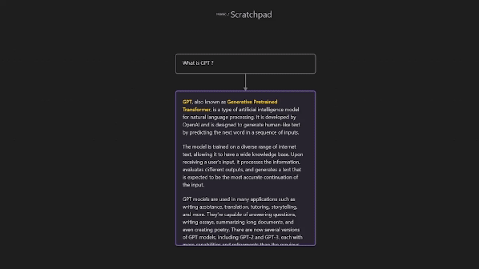
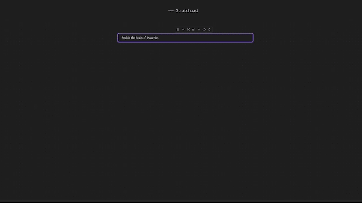

# Obsidian Augmented Canvas

A plugin for [Obsidian](https://obsidian.md) that "augments" Obsidian Canvas with AI features.

You need a OpenAI API Key to use this plugin, you can input it in the settings. The plugin only works with OpenAI latest model : `gpt-4-1106-preview`

## Key Features

This plugin adds three actions to the Menu of a note in the Canvas View.

1. Ask GPT on a specific note, the note content will be used as prompt. A new note will be created underneath the prompt note containing the AI response.

2. Ask question about a note. Also makes GPT generate a new note, the question is placed on the link between the two notes.

3. Generate questions on a specific note using GPT. The generated questions help you easily dig further into the subject of the note.

The links between notes are used to create the chat history sent to GPT.

## Additional Features

-   The plugin adds a command to insert system prompts on the Canvas. The system prompts are fetch from [f/awesome-chatgpt-prompts (github.com)](https://github.com/f/awesome-chatgpt-prompts). You can also add your own system prompts in the settings.

-   The plugin can create flashcards for you which can be revised using the [Spaced Repetition plugin](https://github.com/st3v3nmw/obsidian-spaced-repetition). Right click on a note to create flashcards.

## Installation

-   Not ready for market yet
-   Can be installed via the [Brat](https://github.com/TfTHacker/obsidian42-brat) plugin
-   Manual installation

1. Find the release page on this github page and click
2. Download the latest release zip file
3. Unzip it, copy the unzipped folder to the obsidian plugin folder, make sure there are main.js and manifest.json files
   in the folder
4. Restart obsidian (do not restart also, you have to refresh plugin list), in the settings interface to enable the
   plugin
5. Done!

## Credits

-   [rpggio/obsidian-chat-stream: Obsidian canvas plugin for using AI completion with threads of canvas nodes (github.com)](https://github.com/rpggio/obsidian-chat-stream)
-   [Quorafind/Obsidian-Collapse-Node: A node collapsing plugin for Canvas in Obsidian. (github.com)](https://github.com/quorafind/obsidian-collapse-node)

## Support

If you are enjoying this plugin then please support my work and enthusiasm by buying me a coffee
on [https://www.buymeacoffee.com/metacorp](https://www.buymeacoffee.com/metacorp).
.

